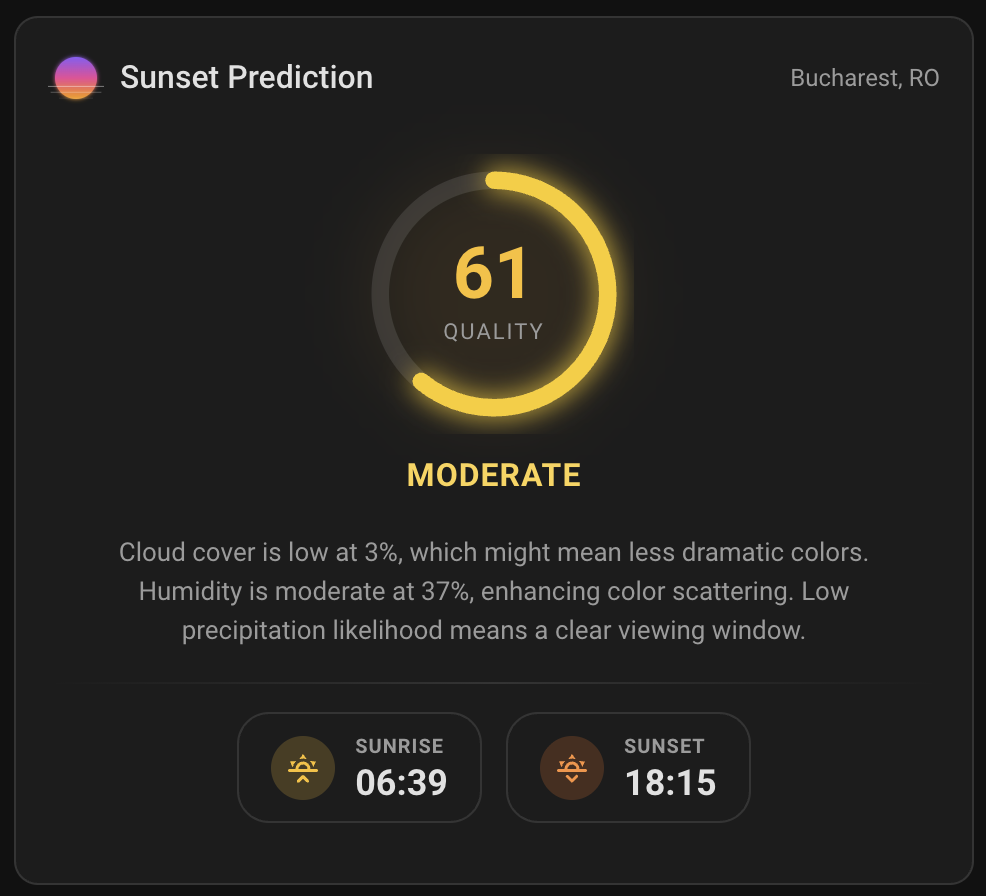

# Sunset Predictor Card

[](https://github.com/hacs/integration)

A custom Lovelace card for Home Assistant that displays sunset quality predictions from [sunset-predictor.com](https://sunset-predictor.com/).

| Minimal | With weather details |
|:---:|:---:|
|  |  |

## Prerequisites

This card requires the **Sunset Predictor integration** to be installed first: [ha-sunset-predictor](https://github.com/sunset-predictor/ha-sunset-predictor)

## Features

- **Sunset quality score** (0–100) with animated SVG ring, color-coded by prediction label
- **Prediction labels**: Low, Fair, Moderate, Good, High, Very High, Excellent, Spectacular
- **Localized explanations** of weather conditions affecting the sunset
- **Sunrise & sunset times** displayed in the location's timezone
- **Weather details grid**: cloud cover, humidity, visibility, wind, rain probability, temperature, pressure, AQI
- **Visual config editor**: set up the card entirely from the HA UI
- Inherits your Home Assistant dark/light theme automatically

## Installation

### HACS (Recommended)

1. Install the [Sunset Predictor integration](https://github.com/sunset-predictor/sunset-predictor) first
2. Open HACS in Home Assistant
3. Go to **Frontend** → click the three dots menu → **Custom repositories**
4. Add this repository URL and select **Dashboard** as the category
5. Search for "Sunset Predictor Card" and install
6. Restart Home Assistant

### Manual

1. Download `sunset-predictor-card.js` from the [latest release](https://github.com/sunset-predictor/sunset-predictor-card/releases/latest)
2. Copy it to your Home Assistant `config/www/` folder
3. Add the card as a Lovelace resource:
   - Go to **Settings → Dashboards → Resources** (or three-dot menu → Resources)
   - Add resource: `/local/sunset-predictor-card.js` with type **JavaScript Module**

## Configuration

### Minimal

```yaml
type: custom:sunset-predictor-card
entity: sensor.sunset_prediction
```

### Full

```yaml
type: custom:sunset-predictor-card
entity: sensor.sunset_prediction
title: Sunset Tonight
show_weather_details: true
show_explanation: true
weather_items:
  clouds: true
  humidity: true
  wind: true
  temperature: true
  visibility: false
  rain: true
  pressure: false
  aqi: true
```

### Options

| Option | Type | Default | Description |
|--------|------|---------|-------------|
| `entity` | string | **required** | Sensor entity ID (e.g., `sensor.sunset_prediction`) |
| `title` | string | `Sunset Prediction` | Card title |
| `show_weather_details` | boolean | `true` | Show the weather details grid |
| `show_explanation` | boolean | `true` | Show the localized explanation text |
| `weather_items` | object | all `true` | Toggle individual weather items (see below) |

#### Weather Items

When `show_weather_details` is enabled, you can selectively show or hide individual items:

```yaml
weather_items:
  clouds: true
  humidity: true
  wind: true
  temperature: true
  visibility: true
  rain: true
  pressure: true
  aqi: true
```

All options can also be configured through the visual editor in the HA UI.

## Development

```bash
npm install
npm run build       # Build once
npm run watch       # Watch mode for development
```

The bundled card is output to `dist/sunset-predictor-card.js`.

## License

MIT

## Credits

- Sunset predictions by [sunset-predictor.com](https://sunset-predictor.com/)
